# 민원 초안 생성 멀티 에이전트 하네스

> **Civil Complaint Draft Generator Harness**  
> `82-report-generator`의 하네스 구조를 민원 업무에 맞게 고도화한 프로젝트입니다.  
> 민원 제목과 본문을 입력하면 여러 AI Agent가 **분류 → 조사 → 초안 작성 → 검증 → 사용자 승인 → 출력** 흐름으로 협업하여 공공기관 민원 답변 초안을 생성합니다.

GitHub: `https://github.com/okokp7608-wq/civil-complaint-agent`

---

## 0. 한 줄 요약

이 프로젝트는 **좋은 문장을 한 번 생성하는 챗봇**이 아니라, 공공 민원 답변 업무를 여러 역할의 Agent가 나누어 처리하고, 결과를 검증하며, 사람이 승인할 수 있도록 만든 **멀티 에이전트 업무 처리 하네스**입니다.

```text
입력
  민원 번호·제목·본문
    ↓
처리
  Classifier → Researcher / Specialist → Drafter
    ↓
검증
  Reviewer / Supervisor가 사실성·근거·표현·개인정보 확인
    ↓
승인
  ADR·승인 게이트·사용자 확인을 통해 다음 단계 진행
    ↓
출력
  민원 답변 초안 + 단계별 JSON 로그 + 비용·홉·검증 기록
```

---

## 1. 제출 요건 대응표

| 요구사항 | README 반영 위치 | 구현/산출물 |
|---|---|---|
| README.md에 하네스 주제 작성 | 2장 | 민원 초안 생성 멀티 에이전트 하네스 |
| 구성 목적 작성 | 3장 | 공공 민원 답변 초안 생성, 검증, 승인, 기록화 |
| 전체 구조 작성 | 4장 | `src/`, `.claude/`, `docs/adr/`, `skills_generated/`, `runs/` |
| 사용 방법 포함 | 13장 | 설치, dry-run, 실제 OpenRouter 실행, 검증 명령 |
| 실행 예시 또는 결과 예시 포함 | 14장, 15장 | 입력 JSON, Expert Pool 처리 예시, 출력 예시, dry-run 결과 |
| AI Agent가 업무를 처리하는 구조 설계 | 5장, 6장, 7장 | 역할별 Agent, Envelope, 6가지 아키텍처 패턴 |
| 입력 → 처리 → 검증 → 출력 흐름이 드러나야 함 | 0장, 8장, 19장 | 전체 흐름도와 단계별 처리 설명 |
| 바이브 코딩 활용 | 18장 | 요구사항 → ADR → 구현 → 검증 → 개선 루프 |
| ADR 기능 및 단계별 승인 | 11장 | `docs/adr/0001~0007`, 승인 게이트 운영 |
| OpenRouter slim 모델 사용 | 12장 | `.env.example`, `openai/gpt-4o-mini` 예시 |
| 멀티에이전트 6개 패턴 지원 | 7장 | Pipeline, Fan-out/Fan-in, Expert Pool, Generate-Verify, Supervisor, Hierarchical |
| 스킬 자동 생성 | 10장 | Progressive Disclosure 기반 `skills_generated/<domain>/SKILL.md` |
| 오케스트레이션 | 9장 | 데이터 전달, 에러 처리, 재시도, 팀 조율 프로토콜 |
| 검증 체계 | 16장 | 트리거 검증, 드라이런, With-skill vs Without-skill 비교 |

---

## 2. 하네스 주제

### 2.1 주제

**공공기관 민원 답변 초안 생성을 위한 멀티 에이전트 하네스**

민원 업무는 단순 문장 생성만으로 끝나지 않습니다. 실제 공공분야 민원 답변에는 다음 요소가 필요합니다.

- 민원 유형 분류
- 담당 분야 또는 전문가 라우팅
- 관련 근거와 확인 필요 사항 정리
- 공공기관 문체에 맞는 답변 초안 작성
- 사실성, 개인정보, 단정 표현, 누락 사항 검증
- 담당자의 최종 승인
- 나중에 감사하거나 복기할 수 있는 실행 기록

따라서 이 프로젝트는 하나의 LLM에게 모든 일을 맡기지 않고, 역할별 Agent가 협업하는 하네스 구조로 설계했습니다.

### 2.2 하네스란?

여기서 하네스는 단순 실행 스크립트가 아니라, Agent가 안전하게 협업하도록 묶어 주는 **업무 처리 프레임워크**입니다.

```text
하네스 = Agent 역할 정의 + 데이터 전달 규칙 + 실행 패턴 + 검증 기준 + 실행 로그 + 승인 절차
```

이 프로젝트에서 하네스는 다음 기능을 담당합니다.

1. 민원 입력을 표준 구조로 받는다.
2. 적절한 Agent를 호출한다.
3. Agent 간 데이터를 `Envelope`로 전달한다.
4. 실패하면 재시도하거나 안전하게 중단한다.
5. 결과가 기준에 미달하면 재작성 또는 검토를 요구한다.
6. 모든 단계별 산출물을 `runs/<run-id>/`에 저장한다.
7. 주요 설계 결정은 ADR로 남긴다.

---

## 3. 구성 목적

이 프로젝트는 `82-report-generator`의 업무 자동화 하네스 개념을 민원 초안 생성에 적용하여 다음 목적을 달성합니다.

### 3.1 업무 관점 목적

| 목적 | 설명 |
|---|---|
| 민원 초안 작성 지원 | 담당자가 처음부터 답변을 쓰는 부담을 줄이고, 검토 가능한 초안을 빠르게 생성 |
| 답변 품질 향상 | 초안 작성 Agent와 검증 Agent를 분리해 누락·과장·단정 표현을 줄임 |
| 분야별 대응력 강화 | 주택, 세무, 교육, 채용, 복무 등 분야별 Specialist를 활용 |
| 사람의 통제 유지 | 최종 답변은 자동 확정하지 않고 담당자 승인 후 사용 |
| 감사 가능성 확보 | 단계별 출력, 오류, 토큰, 검증 결과를 JSON으로 기록 |

### 3.2 기술 관점 목적

| 목적 | 설명 |
|---|---|
| 멀티 에이전트 패턴 비교 | 6개 아키텍처 패턴을 같은 민원 데이터에 적용하여 차이를 비교 |
| 컨텍스트 효율화 | Progressive Disclosure 스킬 구조로 필요한 지식만 로딩 |
| 비용 통제 | OpenRouter slim 모델, 최대 홉 수, 최대 토큰 수, mock dry-run 지원 |
| 재현 가능한 검증 | 트리거 테스트, 드라이런 스위트, 스킬 적용 전후 비교 제공 |
| 설계 의사결정 기록 | ADR로 왜 그런 구조를 선택했는지 남김 |

### 3.3 공공분야 적용 관점 목적

공공분야에서는 단순히 모델 성능이 높은 것보다 **설명가능성, 재현가능성, 책임성, 승인 절차**가 중요합니다.

이 프로젝트는 다음 원칙을 따릅니다.

- AI 결과는 최종 답변이 아니라 **초안**이다.
- 사실관계와 법령 근거는 담당자가 최종 확인한다.
- 개인정보와 민감정보는 불필요하게 출력하지 않는다.
- 모델의 판단 흐름을 로그로 남긴다.
- 사람이 개입할 수 있는 승인 게이트를 둔다.

---

## 4. 전체 프로젝트 구조

```text
civil-complaint-agent/
├── README.md
│   └── 프로젝트 설명, 구조, 사용법, 실행 예시, 검증 방법
│
├── plan.md
│   └── 단계별 개발 계획과 승인 기준
│
├── requirements.txt
│   └── Python 실행 의존성
│
├── .env.example
│   └── OpenRouter API 키, 모델, 안전 한도 설정 예시
│
├── data/
│   └── sample_complaints.json
│       └── 테스트용 합성 민원 8건
│
├── docs/
│   └── adr/
│       ├── 0001-overall-architecture.md
│       ├── 0002-envelope-and-error-handling.md
│       ├── 0003-six-pattern-taxonomy.md
│       ├── 0004-agent-boundaries-and-harness-twin.md
│       ├── 0005-skill-generation-strategy.md
│       ├── 0006-validation-strategy.md
│       └── 0007-model-selection-and-measured-results.md
│
├── src/
│   └── complaint_agent/
│       ├── __main__.py
│       ├── cli.py
│       ├── config.py
│       ├── envelope.py
│       ├── llm_client.py
│       │
│       ├── agents/
│       │   ├── base.py
│       │   ├── classifier.py
│       │   ├── researcher.py
│       │   ├── drafter.py
│       │   ├── reviewer.py
│       │   ├── specialists.py
│       │   └── supervisor.py
│       │
│       ├── patterns/
│       │   ├── pipeline.py
│       │   ├── fanout_fanin.py
│       │   ├── expert_pool.py
│       │   ├── generate_verify.py
│       │   ├── supervisor.py
│       │   └── hierarchical.py
│       │
│       ├── skills/
│       │   └── generator.py
│       │
│       └── validation/
│           ├── trigger_tests.py
│           ├── dry_run.py
│           └── skill_ablation.py
│
├── skills_generated/
│   ├── education/SKILL.md
│   ├── general_hr/SKILL.md
│   ├── housing/SKILL.md
│   ├── recruitment/SKILL.md
│   └── tax/SKILL.md
│
├── .claude/
│   ├── CLAUDE.md
│   ├── agents/
│   │   ├── classifier.md
│   │   ├── researcher.md
│   │   ├── drafter.md
│   │   └── reviewer.md
│   └── skills/
│       └── civil-complaint-drafter/skill.md
│
└── runs/
    └── <pattern>_<case>_<run-id>/
        ├── 01_classification.json
        ├── 02_research_or_routing.json
        ├── 03_draft.json
        ├── 04_review.json
        └── run_<run-id>.json
```

### 4.1 `src/complaint_agent/`

실제 실행 가능한 Python 앱입니다. OpenRouter API를 호출하거나 `--dry-run` 모드에서 mock LLM으로 전체 배선을 검증합니다.

### 4.2 `.claude/`

Claude Code용 하네스 트윈입니다. Python 코드와 같은 역할 경계를 Claude Code의 Agent/Skill 문서 형식으로 표현합니다.

### 4.3 `docs/adr/`

주요 설계 결정을 기록한 Architecture Decision Record입니다. 어떤 구조를 왜 선택했는지, 장단점과 영향은 무엇인지 남깁니다.

### 4.4 `skills_generated/`

분야별 전문가 스킬을 자동 생성한 결과입니다. Progressive Disclosure 방식으로 필요한 컨텍스트만 열람하도록 설계합니다.

### 4.5 `runs/`

실행 결과 저장소입니다. 한 번 실행할 때마다 단계별 산출물과 전체 실행 로그가 남습니다.

---

## 5. 멀티 에이전트 기본 개념

### 5.1 Agent란?

Agent는 단순 프롬프트가 아니라, 특정 역할과 책임을 가진 작업자입니다.

```text
Agent = 역할 + 입력 형식 + 처리 원칙 + 출력 형식 + 실패 처리 규칙
```

예를 들어 민원 초안 생성에서 하나의 Agent가 모든 일을 처리하면 다음 문제가 생깁니다.

- 분류가 틀려도 작성 단계가 그대로 진행될 수 있음
- 근거가 부족해도 자연스러운 문장으로 포장될 수 있음
- 자기 자신이 작성한 답변을 스스로 검증하므로 오류를 놓치기 쉬움
- 어느 단계에서 문제가 생겼는지 추적하기 어려움

그래서 본 프로젝트는 업무를 여러 Agent로 나눕니다.

### 5.2 Agent 팀 구성

| Agent | 한 줄 역할 | 핵심 책임 | 하지 않는 일 |
|---|---|---|---|
| Classifier | 민원 분류자 | 민원 유형, 위험도, 분야 판단 | 답변 작성, 법령 단정 |
| Researcher | 근거 조사자 | 관련 근거, 확인 필요 사항, 주의점 정리 | 최종 문구 확정 |
| Specialist | 분야 전문가 | 주택·세무·교육·채용 등 도메인별 검토 | 모든 분야에 무조건 개입 |
| Drafter | 초안 작성자 | 공공기관 문체로 답변 초안 작성 | 자기 검증, 최종 승인 |
| Reviewer | 검증자 | 사실성, 근거, 표현, 개인정보, 누락 검토 | 직접 초안 수정 |
| Supervisor | 감독자 | 다음 Agent 선택, 재시도, 중단 판단 | 모든 세부 작업 직접 수행 |

### 5.3 역할 분리의 핵심

이 프로젝트에서 가장 중요한 설계 원칙은 **작성자와 검증자를 분리하는 것**입니다.

```text
Drafter는 쓴다.
Reviewer는 검사한다.
Reviewer가 직접 고치지 않고, 보완 필요 사항을 Drafter에게 돌려보낸다.
```

이렇게 해야 생성-검증 루프가 명확해지고, 어느 Agent가 어떤 책임을 졌는지 추적할 수 있습니다.

---

## 6. 입력·처리·검증·출력 흐름

### 6.1 기본 흐름

```text
[1] 입력
    민원 번호, 제목, 본문

[2] 분류
    Classifier가 민원 분야를 판단

[3] 조사 또는 전문가 검토
    Researcher가 근거를 정리하거나 Specialist가 분야별 의견 제시

[4] 초안 작성
    Drafter가 공공기관 답변 형식으로 초안 생성

[5] 검증
    Reviewer가 사실성·논리성·표현·개인정보·근거 검토

[6] 승인 또는 재작성
    기준 미달이면 Drafter에게 재작성 요청
    기준 충족이면 사용자 승인 대상으로 이동

[7] 출력
    답변 초안과 전체 실행 기록 저장
```

### 6.2 데이터 흐름

```text
Complaint
  ↓
Envelope 생성
  ↓
Classifier Hop 추가
  ↓
Researcher 또는 Specialist Hop 추가
  ↓
Drafter Hop 추가
  ↓
Reviewer Hop 추가
  ↓
Run 저장
```

### 6.3 입력 예시

```json
{
  "id": 7,
  "title": "공무원 주택자금 대출 지원 문의",
  "body": "무주택 공무원을 대상으로 하는 주택자금 대출 지원 제도가 있다고 들었습니다. 대출 한도와 금리, 신청 자격 요건이 어떻게 되는지 알고 싶습니다.",
  "category_hint": "주택·복지"
}
```

### 6.4 처리 예시

```text
1. Classifier
   - 입력: 민원 제목과 본문
   - 출력: 주택·복지

2. Expert Router
   - 입력: 분류 결과
   - 출력: housing Specialist 선택

3. Housing Specialist
   - 입력: 주택자금 대출 문의
   - 출력: 지원 대상, 확인 서류, 유의사항

4. Drafter
   - 입력: 민원 원문 + 전문가 의견
   - 출력: 공식 답변 초안

5. Reviewer
   - 입력: 답변 초안
   - 출력: 승인 또는 수정 필요 의견
```

### 6.5 출력 예시

```text
안녕하십니까. 귀하께서 문의하신 주택자금 대출 지원 대상 및 신청 절차에 대해 안내드립니다.

해당 제도의 지원 가능 여부는 재직 상태, 무주택 여부, 소득 및 대출 기준, 소속 기관의 운영 기준에 따라 달라질 수 있습니다. 정확한 대상 여부와 제출 서류는 소속 기관의 복지 담당 부서 또는 해당 대출 운영기관을 통해 확인하시기 바랍니다.

추가로 확인이 필요한 사항이 있는 경우 담당 부서에 문의해 주시면 안내드리겠습니다. 감사합니다.
```

---

## 7. 지원하는 6가지 멀티 에이전트 아키텍처 패턴

이 프로젝트는 같은 민원 업무를 6가지 방식으로 처리할 수 있도록 설계했습니다. 목적은 단순히 기능을 늘리는 것이 아니라, **업무 복잡도와 비용·품질 요구에 따라 적절한 Agent 팀 구조를 선택**할 수 있게 하는 것입니다.

### 7.1 패턴 비교표

| 패턴 | 구조 | 적합한 상황 | 장점 | 주의점 |
|---|---|---|---|---|
| Pipeline | 고정 순서 | 표준 민원, 단순 처리 | 가장 단순하고 안정적 | 복잡한 예외 대응 약함 |
| Fan-out/Fan-in | 병렬 분석 후 통합 | 여러 관점 검토 필요 | 다양한 관점 확보 | 통합 기준 필요 |
| Expert Pool | 분야별 전문가 선택 | 민원 분야가 뚜렷함 | 비용 절감, 전문성 강화 | 분류가 틀리면 라우팅 오류 |
| Generate-Verify | 작성·검증 반복 | 품질 기준이 높음 | 품질 향상 가능 | 토큰 비용 증가 |
| Supervisor | 감독자가 동적 선택 | 예외가 많은 민원 | 유연한 진행 | 감독 판단 실패 가능 |
| Hierarchical | 계층형 위임 | 복합 민원, 큰 업무 | 조직 구조와 유사 | 홉 수와 비용 증가 |

### 7.2 Pipeline 패턴

가장 기본적인 구조입니다.

```text
민원 입력 → 분류 → 조사 → 작성 → 검증 → 출력
```

**사용 명령**

```bash
PYTHONPATH=src python -m complaint_agent run --pattern pipeline --case 1 --dry-run
```

**장점**

- 단계가 명확하다.
- 디버깅이 쉽다.
- 공공기관의 표준 처리 절차와 유사하다.
- 실행 비용이 예측 가능하다.

**단점**

- 복합 민원처럼 여러 분야가 얽힌 경우 유연성이 부족하다.
- 각 단계가 한 번씩만 실행되므로 품질 보완 여지가 제한된다.

### 7.3 Fan-out/Fan-in 패턴

하나의 민원을 여러 관점으로 나누어 동시에 검토하고, 다시 합쳐서 답변을 작성합니다.

```text
                    ┌→ 법·제도 관점 Researcher ─┐
민원 → 분류/분산 ──┼→ 과거 답변 관점 Researcher ├→ 통합 → 작성 → 검증
                    └→ 유사 사례 관점 Researcher ┘
```

**사용 명령**

```bash
PYTHONPATH=src python -m complaint_agent run --pattern fanout_fanin --case 1 --dry-run
```

**장점**

- 여러 관점을 빠르게 수집할 수 있다.
- 누락 가능성을 줄일 수 있다.
- 향후 실제 검색 도구와 결합하기 좋다.

**주의점**

- 병렬 결과가 서로 충돌할 수 있다.
- 통합 기준이 불명확하면 답변이 장황해질 수 있다.

### 7.4 Expert Pool 패턴

분류 결과에 따라 적절한 분야 전문가 Agent를 선택합니다.

```text
민원 → Classifier → Expert Router → 분야별 Specialist → Drafter → Reviewer
```

지원 도메인 예시:

| 도메인 | 관련 민원 |
|---|---|
| `general_hr` | 연가, 휴가, 복무, 인사 일반 |
| `recruitment` | 채용시험, 응시자격, 가산점 |
| `housing` | 주택자금, 복지 지원 |
| `education` | 교육훈련, 이수 의무 |
| `tax` | 원천징수, 연말정산, 세무 |

**사용 명령**

```bash
PYTHONPATH=src python -m complaint_agent run --pattern expert_pool --case 7 --dry-run
```

**장점**

- 모든 전문가를 매번 호출하지 않으므로 비용을 줄일 수 있다.
- 민원 분야에 맞는 전문 지침을 적용할 수 있다.
- Progressive Disclosure 스킬과 자연스럽게 결합된다.

**주의점**

- 첫 분류가 틀리면 잘못된 전문가에게 전달될 수 있다.
- 복합 민원은 하나의 전문가만으로 부족할 수 있다.

### 7.5 Generate-Verify 패턴

초안을 만들고 검증한 뒤, 기준 미달이면 다시 작성합니다.

```text
분류 → 조사 → 초안 작성 → 검증
                      ↑        ↓
                 재작성 요청 ← 수정 필요
```

**사용 명령**

```bash
PYTHONPATH=src python -m complaint_agent run --pattern generate_verify --case 2 --dry-run
```

**장점**

- 답변 품질을 높일 수 있다.
- Reviewer의 피드백을 반영해 초안을 개선할 수 있다.
- 민원 답변처럼 품질 기준이 중요한 업무에 적합하다.

**주의점**

- 반복할수록 토큰과 비용이 증가한다.
- 무한 루프 방지를 위해 `MAX_HOPS`, `REWORK_LIMIT`, `MAX_TOKENS_TOTAL`이 필요하다.

### 7.6 Supervisor 패턴

감독 Agent가 현재 상태를 보고 다음 작업을 결정합니다.

```text
민원 입력
   ↓
Supervisor
   ├─ Classifier 호출
   ├─ Researcher 호출
   ├─ Drafter 호출
   ├─ Reviewer 호출
   └─ DONE 또는 재작업 판단
```

**사용 명령**

```bash
PYTHONPATH=src python -m complaint_agent run --pattern supervisor --case 4 --dry-run
```

**장점**

- 고정 순서가 아니라 상황에 따라 다음 단계를 선택할 수 있다.
- 누락된 단계가 있으면 Supervisor가 보완을 지시할 수 있다.
- 예외 처리가 필요한 업무에 적합하다.

**주의점**

- Supervisor의 판단 프로토콜이 명확해야 한다.
- 저비용 모델은 지시한 키워드 형식을 어길 수 있으므로 폴백 로직이 필요하다.

### 7.7 Hierarchical Delegation 패턴

상위 감독자가 하위 팀장에게 업무를 위임하고, 하위 팀장이 다시 작업 Agent에게 위임합니다.

```text
총괄 Supervisor
      ↓
 ┌───────────────┐
 │               │
Research Team    Draft Team
 │               │
법령/사례/답변    Drafter ↔ Reviewer
 │               │
 └─────── 통합 ───┘
      ↓
최종 출력
```

**사용 명령**

```bash
PYTHONPATH=src python -m complaint_agent run --pattern hierarchical --case 3 --dry-run
```

**장점**

- 실제 조직의 업무 위임 구조와 유사하다.
- 복잡한 민원을 하위 과제로 나누어 처리할 수 있다.
- 큰 규모의 Agent 팀으로 확장하기 쉽다.

**주의점**

- 홉 수가 빠르게 증가한다.
- 비용 서킷브레이커가 없으면 토큰 스노볼이 발생할 수 있다.
- 간단한 민원에는 과한 구조일 수 있다.

---

## 8. Agent별 상세 설계

### 8.1 Classifier Agent

**역할**: 민원 유형과 담당 분야를 판단합니다.

입력:

```text
민원 제목
민원 본문
```

출력:

```text
복무·휴가 | 보수·수당 | 인사·복무 | 채용 | 복무규정 | 교육훈련 | 주택·복지 | 세무 | 기타
```

설계 이유:

- Expert Pool 라우팅의 시작점이다.
- 분류 체계가 고정되어야 검증과 비교가 가능하다.
- 답변을 쓰지 않고 분류에만 집중한다.

### 8.2 Researcher Agent

**역할**: 관련 근거, 확인 필요 사항, 주의점을 정리합니다.

Researcher는 실제 법률 자문자가 아니라, 답변 초안 작성을 위한 참고 정보를 정리하는 Agent입니다.

검토 관점:

- 관련 규정 또는 확인이 필요한 제도
- 민원인이 물어본 핵심 질문
- 단정하면 위험한 부분
- 담당 부서가 최종 확인해야 하는 사항

### 8.3 Specialist Agent

**역할**: 특정 분야에 특화된 의견을 제공합니다.

예시:

```text
housing Specialist
  - 주택자금 대출 지원 대상
  - 무주택 요건
  - 신청 기관 확인
  - 소속기관 복지 담당 부서 안내
```

Specialist는 Expert Pool 패턴에서 선택적으로 호출됩니다.

### 8.4 Drafter Agent

**역할**: 민원 답변 초안을 작성합니다.

작성 원칙:

- 공공기관 문체를 사용한다.
- 민원인의 질문에 직접 답한다.
- 확인되지 않은 내용을 단정하지 않는다.
- 필요하면 담당 부서 확인 문구를 포함한다.
- 법령·규정은 실제 운영 시점에서 담당자가 확인해야 함을 남긴다.

출력 형식:

```text
귀하께서 문의하신 사항에 대해 다음과 같이 안내드립니다.

1. 문의 요지
2. 검토 내용
3. 신청 또는 확인 절차
4. 추가 안내
```

### 8.5 Reviewer Agent

**역할**: 초안을 검증합니다.

검증 항목:

| 항목 | 확인 내용 |
|---|---|
| 사실성 | 근거 없는 단정이 있는가 |
| 관련성 | 민원 질문에 직접 답했는가 |
| 완전성 | 핵심 질문을 빠뜨리지 않았는가 |
| 표현 | 공공기관 답변 문체에 적절한가 |
| 개인정보 | 불필요한 개인정보가 포함되었는가 |
| 안전성 | 법률·인사·세무 판단을 과도하게 단정하지 않았는가 |

Reviewer는 직접 초안을 고치지 않고, `승인` 또는 `수정필요` 의견을 반환합니다.

### 8.6 Supervisor Agent

**역할**: 팀 전체의 진행을 조율합니다.

Supervisor의 판단 예시:

```text
아직 분류가 없으면 CLASSIFY
근거가 부족하면 RESEARCH
초안이 없으면 DRAFT
초안이 있으면 REVIEW
검증이 충분하면 DONE
```

Supervisor가 필요한 이유:

- 복잡한 민원은 고정 파이프라인만으로 부족할 수 있다.
- 어느 단계가 누락되었는지 확인해야 한다.
- 필요 이상 반복하지 않도록 중단해야 한다.

---

## 9. 오케스트레이션 설계

### 9.1 Envelope 기반 데이터 전달

Agent 사이의 데이터는 `Envelope` 역할을 하는 `Run`과 `Hop` 구조로 기록됩니다.

```text
Run
  - run_id
  - pattern
  - complaint_id
  - max_tokens_total
  - max_hops
  - final_status
  - hops[]

Hop
  - step_id
  - agent
  - model
  - handoff_type
  - parent_step_id
  - input_ref
  - output
  - status
  - tokens_in
  - tokens_out
  - cumulative_tokens
  - timestamp
```

### 9.2 Handoff와 Delegate 구분

| 구분 | 의미 | 예시 |
|---|---|---|
| Handoff | 다음 Agent에게 넘기고 되돌아오지 않음 | Classifier → Researcher |
| Delegate | 작업을 위임하고 결과를 받아 재판단 | Reviewer → Drafter 재작성 요청 |

이 구분은 Generate-Verify, Supervisor, Hierarchical 패턴에서 중요합니다.

### 9.3 상태값

실행 결과는 다음 상태 중 하나로 정리됩니다.

| 상태 | 의미 |
|---|---|
| `ok` | 정상 완료 |
| `flagged` | 실행은 완료되었지만 검토 필요 |
| `halted_budget` | 최대 홉 또는 토큰 한도 때문에 중단 |
| `halted_error` | 핵심 단계 오류로 중단 |

### 9.4 에러 핸들링

```text
OpenRouter 호출 실패
    ↓
재시도(MAX_RETRIES)
    ↓
실패 시 fallback 모델 호출
    ↓
비핵심 단계면 skipped 기록 후 진행
핵심 단계면 halted_error로 중단
```

에러 핸들링 원칙:

- 실패를 숨기지 않고 로그에 남긴다.
- 검색·조사 같은 비핵심 단계는 스킵 후 진행할 수 있다.
- 작성·검증 같은 핵심 단계 실패는 중단한다.
- 반복 구조는 반드시 최대 홉 수와 토큰 한도를 둔다.

### 9.5 비용·홉 서킷브레이커

멀티 에이전트의 가장 큰 위험은 Agent를 많이 호출하면서 토큰이 누적되는 것입니다.

이 프로젝트는 다음 한도를 사용합니다.

```env
MAX_RETRIES=3
MAX_HOPS=12
MAX_TOKENS_TOTAL=200000
```

특히 Generate-Verify와 Hierarchical은 반복 구조가 있으므로 한도 설정이 필수입니다.

---

## 10. Progressive Disclosure 기반 스킬 자동 생성

### 10.1 왜 필요한가?

민원 분야별 지식을 모두 프롬프트에 넣으면 컨텍스트가 길어지고 비용이 증가합니다.

예를 들어 주택, 세무, 교육, 채용, 복무 지침을 매번 전부 넣으면 실제로는 주택 민원 하나를 처리하는 데도 불필요한 토큰을 많이 사용합니다.

따라서 이 프로젝트는 필요한 스킬만 단계적으로 공개하는 Progressive Disclosure 구조를 사용합니다.

### 10.2 Progressive Disclosure 구조

```text
1단계: 스킬 이름과 설명만 상시 노출
       예: housing-specialist는 주택·복지 민원에 사용

2단계: 트리거될 때 SKILL.md 본문 로딩
       예: 주택자금, 무주택, 복지 키워드가 있을 때

3단계: 세부 지침이 길 경우 reference/details.md 추가 로딩
       예: 세부 기준, 사례, 체크리스트
```

### 10.3 자동 생성 결과

```text
skills_generated/
├── education/SKILL.md
├── general_hr/SKILL.md
├── housing/SKILL.md
├── recruitment/SKILL.md
└── tax/SKILL.md
```

### 10.4 스킬 생성 명령

모든 도메인 생성:

```bash
PYTHONPATH=src python -m complaint_agent generate-skills --dry-run
```

특정 도메인 생성:

```bash
PYTHONPATH=src python -m complaint_agent generate-skills --domain housing --dry-run
```

실제 OpenRouter 모델로 본문 초안 생성:

```bash
PYTHONPATH=src python -m complaint_agent generate-skills --domain housing
```

### 10.5 스킬 적용 전후 비교

With-skill vs Without-skill 비교는 같은 민원에 대해 다음 두 조건을 비교합니다.

```text
A. 도메인 스킬 또는 Specialist를 적용한 답변
B. 범용 Drafter만 사용한 답변
```

비교 항목:

- 토큰 사용량
- 답변 구체성
- 민원 분야 적합성
- 누락 여부
- Reviewer 통과 가능성

---

## 11. ADR 기능과 단계별 승인 프로세스

### 11.1 ADR의 의미

ADR은 **Architecture Decision Record**의 약자입니다.

즉, 시스템 설계 과정에서 중요한 결정을 내릴 때 다음을 기록하는 문서입니다.

```text
무엇을 결정했는가?
왜 그렇게 결정했는가?
다른 선택지는 무엇이었는가?
장점과 단점은 무엇인가?
향후 어떤 영향을 주는가?
```

### 11.2 이 프로젝트의 ADR 목록

| ADR | 제목 | 핵심 결정 |
|---|---|---|
| ADR-0001 | 전체 아키텍처 | 실행 가능한 Python 앱과 Claude Code 하네스 트윈 병행 |
| ADR-0002 | Envelope와 에러 처리 | 홉별 로그, 비용 추적, 서킷브레이커 도입 |
| ADR-0003 | 6개 패턴 분류 | Handoff/Delegate와 계층 단수 기준으로 패턴 구분 |
| ADR-0004 | Agent 경계 | Classifier, Researcher, Drafter, Reviewer 책임 분리 |
| ADR-0005 | 스킬 생성 전략 | frontmatter는 결정적, 본문은 LLM 초안, reference는 조건부 |
| ADR-0006 | 검증 전략 | 트리거, 드라이런, ablation 검증 코드화 |
| ADR-0007 | 모델 선택과 실측 | OpenRouter slim 모델로 비용·품질 측정 |

### 11.3 단계별 승인 게이트

사용자의 요구사항인 **한 단계씩 프로세스를 진행하면서 승인받는 방식**을 ADR 중심으로 운영합니다.

```text
요구사항 확인
    ↓
ADR 초안 작성
    ↓
선택지·장점·단점·영향 설명
    ↓
사용자 승인
    ↓
구현
    ↓
드라이런 또는 테스트
    ↓
결과 확인
    ↓
사용자 승인
    ↓
다음 단계 진행
```

승인 게이트 예시:

| Gate | 승인 대상 | 승인 전 하지 않는 작업 |
|---|---|---|
| Gate 1 | 전체 아키텍처 | 핵심 구조 확정 구현 |
| Gate 2 | Agent 역할 경계 | Agent 프롬프트와 클래스 확정 |
| Gate 3 | 6개 패턴 설계 | 오케스트레이션 구현 확정 |
| Gate 4 | 스킬 구조 | 스킬 대량 생성 |
| Gate 5 | 검증 기준 | 품질 결과 확정 |
| Gate 6 | 모델·비용·한도 | 실제 운영 실행 |

### 11.4 ADR 템플릿

새로운 기능을 추가할 때는 아래 형식을 권장합니다.

```md
# 0008. 결정 제목

* Status: proposed | accepted | superseded
* Date: YYYY-MM-DD

## Context and Problem Statement
현재 문제가 무엇인가?

## Decision Drivers
결정에 영향을 준 조건은 무엇인가?

## Considered Options
1. 선택지 A
2. 선택지 B
3. 선택지 C

## Decision Outcome
어떤 선택지를 채택했는가?

## Consequences
좋은 점, 나쁜 점, 향후 영향은 무엇인가?
```

---

## 12. LLM 설정: OpenRouter slim 모델

### 12.1 기본 방향

이 프로젝트는 OpenRouter API를 사용합니다. 과제 요구에 맞게 **저비용 slim 모델**을 사용하도록 `.env.example`에 예시를 제공합니다.

```env
OPENROUTER_API_KEY=sk-or-v1-여기에_본인_키

OPENROUTER_MODEL_DEFAULT=openai/gpt-4o-mini
OPENROUTER_MODEL_FALLBACK=openai/gpt-4o-mini

MAX_RETRIES=3
MAX_HOPS=12
MAX_TOKENS_TOTAL=200000
MOCK_LLM=0
```

### 12.2 dry-run과 실제 실행 차이

| 모드 | API 비용 | 목적 |
|---|---:|---|
| `--dry-run` | 없음 | Agent 배선, 파일 생성, 패턴 흐름 검증 |
| 실제 실행 | 있음 | 실제 답변 품질, 토큰 비용, 모델 안정성 확인 |

### 12.3 운영 주의

- `.env` 파일은 절대 GitHub에 올리지 않습니다.
- OpenRouter 모델 ID와 가격은 운영 시점에 다시 확인합니다.
- 품질이 중요한 민원은 저비용 모델만 믿지 않고 사람 검토를 거칩니다.
- Generate-Verify, Hierarchical 패턴은 토큰이 많이 늘 수 있으므로 먼저 dry-run을 수행합니다.

---

## 13. 설치 및 사용 방법

### 13.1 설치

```bash
git clone https://github.com/okokp7608-wq/civil-complaint-agent.git
cd civil-complaint-agent
pip install -r requirements.txt
```

Windows PowerShell:

```powershell
Copy-Item .env.example .env
$env:PYTHONPATH="src"
python -m complaint_agent --help
```

macOS / Linux:

```bash
cp .env.example .env
export PYTHONPATH=src
python -m complaint_agent --help
```

### 13.2 전체 도움말

```bash
PYTHONPATH=src python -m complaint_agent --help
```

예상 출력:

```text
usage: complaint_agent [-h] {run,generate-skills,validate} ...

positional arguments:
  {run,generate-skills,validate}
    run                 민원 1건에 대해 지정한 패턴을 실행한다.
    generate-skills     expert-pool 도메인 전문가 스킬을 자동 생성한다.
    validate            검증체계(트리거/드라이런/ablation)를 실행한다.
```

### 13.3 민원 1건 실행

```bash
PYTHONPATH=src python -m complaint_agent run --pattern pipeline --case 1 --dry-run
```

사용 가능한 패턴:

```text
pipeline
fanout_fanin
expert_pool
generate_verify
supervisor
hierarchical
```

### 13.4 실제 OpenRouter 모델로 실행

`.env`에 API 키를 넣은 후 실행합니다.

```bash
PYTHONPATH=src python -m complaint_agent run --pattern expert_pool --case 7
```

### 13.5 검증 실행

트리거 검증:

```bash
PYTHONPATH=src python -m complaint_agent validate --trigger-tests
```

6개 패턴 드라이런:

```bash
PYTHONPATH=src python -m complaint_agent validate --dry-run-suite --case 1 --dry-run
```

With-skill vs Without-skill 비교:

```bash
PYTHONPATH=src python -m complaint_agent validate --ablation --dry-run
```

여러 검증을 한 번에 실행:

```bash
PYTHONPATH=src python -m complaint_agent validate --trigger-tests --dry-run-suite --case 1 --dry-run
```

---

## 14. 실행 예시

### 14.1 입력 데이터

`data/sample_complaints.json`에는 테스트용 합성 민원 8건이 들어 있습니다.

예시:

```json
{
  "id": 1,
  "title": "연차휴가 이월 가능 여부 문의",
  "body": "저는 올해 사용하지 못한 연차휴가 5일이 남아 있습니다. 코로나 확진으로 격리되어 연말에 연차를 사용하지 못했는데, 다음 연도로 이월해서 사용할 수 있는지, 아니면 연가보상비로 지급받을 수 있는지 궁금합니다.",
  "category_hint": "복무·휴가"
}
```

### 14.2 Pipeline 실행 예시

명령:

```bash
PYTHONPATH=src python -m complaint_agent run --pattern pipeline --case 1 --dry-run
```

흐름:

```text
01_classification.json
  Classifier가 민원을 복무·휴가로 분류

02_research.json
  Researcher가 관련 근거와 확인 필요 사항 정리

03_draft.json
  Drafter가 민원 답변 초안 작성

04_review.json
  Reviewer가 수정 필요 사항 또는 승인 여부 검토

run_<run-id>.json
  전체 홉, 토큰, 상태, 산출물 저장
```

### 14.3 Expert Pool 실행 예시

명령:

```bash
PYTHONPATH=src python -m complaint_agent run --pattern expert_pool --case 7 --dry-run
```

흐름:

```text
공무원 주택자금 대출 지원 문의
    ↓
Classifier: 주택·복지
    ↓
Router: housing Specialist 선택
    ↓
Housing Specialist: 지원 대상·신청 절차·확인 필요 사항 정리
    ↓
Drafter: 공공기관 답변 초안 작성
    ↓
Reviewer: 단정 표현·근거 부족·개인정보 검토
```

### 14.4 Generate-Verify 실행 예시

명령:

```bash
PYTHONPATH=src python -m complaint_agent run --pattern generate_verify --case 2 --dry-run
```

흐름:

```text
초과근무수당 문의
    ↓
분류
    ↓
조사
    ↓
초안 작성 v1
    ↓
검증 v1: 수정 필요
    ↓
초안 작성 v2
    ↓
검증 v2
    ↓
초안 작성 v3
    ↓
검증 v3 또는 한도 도달
```

이 패턴은 품질을 높일 수 있지만, 반복이 많아져 비용이 증가할 수 있습니다.

---

## 15. 실행 결과 저장 구조

### 15.1 저장 위치

모든 실행 결과는 `runs/<run-id>/`에 저장됩니다.

```text
runs/pipeline_1_45cdaaf4/
├── 01_classification.json
├── 02_research.json
├── 03_draft.json
├── 04_review.json
└── run_pipeline_1_45cdaaf4.json
```

### 15.2 단계 파일 예시

각 단계 파일에는 다음 정보가 저장됩니다.

```json
{
  "step_id": "01",
  "agent": "classifier",
  "model": "openai/gpt-4o-mini",
  "handoff_type": "handoff",
  "input_ref": "complaint",
  "output": "복무·휴가",
  "status": "ok",
  "tokens_in": 211,
  "tokens_out": 6,
  "cumulative_tokens": 217,
  "timestamp": "2026-07-10T..."
}
```

### 15.3 전체 Run 파일

`run_<run-id>.json`에는 다음 정보가 포함됩니다.

- 원본 민원 ID
- 실행 패턴
- 최종 상태
- 모든 Hop 목록
- Agent별 출력
- 토큰 사용량
- 오류·스킵·재시도 기록
- 최종 산출물

---

## 16. 검증 체계

### 16.1 트리거 검증

목적:

```text
이 하네스가 호출되어야 하는 요청과 호출되지 않아야 하는 요청을 구분한다.
```

예시:

| 문장 | 기대 결과 |
|---|---|
| 민원 답변 초안 만들어줘 | should-trigger |
| 이 민원 분류해줘 | should-trigger |
| 이번 분기 매출 실적 보고서 만들어줘 | NOT-trigger |
| 이 정책 결정에 대한 ADR 작성해줘 | NOT-trigger |

명령:

```bash
PYTHONPATH=src python -m complaint_agent validate --trigger-tests
```

### 16.2 드라이런 테스트

목적:

```text
실제 API 비용 없이 6개 패턴이 모두 실행 가능한지 확인한다.
```

검증 항목:

- 예외 없이 실행되는가
- `runs/<run-id>/` 파일이 생성되는가
- `hops ≤ max_hops` 조건을 지키는가
- 토큰 누적값이 단조 증가하는가
- 최종 상태가 허용된 값인가

명령:

```bash
PYTHONPATH=src python -m complaint_agent validate --dry-run-suite --case 1 --dry-run
```

실행 예시 결과:

```text
OK   pipeline         hops= 4 tokens=  435 final=flagged
OK   fanout_fanin     hops= 7 tokens=  708 final=flagged
OK   expert_pool      hops= 4 tokens=  278 final=flagged
OK   generate_verify  hops= 8 tokens=  935 final=flagged
OK   supervisor       hops= 9 tokens= 1072 final=flagged
OK   hierarchical     hops=12 tokens=  987 final=halted_budget
```

`hierarchical`의 `halted_budget`은 실패가 아니라, 최대 홉 수에 도달했을 때 안전하게 중단되는지 확인한 결과입니다.

### 16.3 With-skill vs Without-skill 비교

목적:

```text
도메인 스킬을 사용했을 때와 사용하지 않았을 때의 품질·비용 차이를 비교한다.
```

명령:

```bash
PYTHONPATH=src python -m complaint_agent validate --ablation --dry-run
```

비교 관점:

| 항목 | 설명 |
|---|---|
| 토큰 사용량 | 스킬 적용 시 컨텍스트 증가 여부 |
| 답변 구체성 | 분야별 조건과 확인사항이 더 잘 반영되는지 |
| 민원 적합성 | 질문에 직접 답하는지 |
| 누락 여부 | 신청 절차, 자격, 제한 사항 등을 빠뜨리지 않는지 |
| 검증 통과 가능성 | Reviewer 기준을 더 잘 만족하는지 |

### 16.4 Reviewer 품질 기준

Reviewer는 최소한 다음을 확인합니다.

```text
[사실성]
- 확인되지 않은 제도나 법령을 단정하지 않았는가?

[관련성]
- 민원인이 질문한 내용에 직접 답했는가?

[완전성]
- 대상, 조건, 절차, 문의 경로 등 핵심 항목을 빠뜨리지 않았는가?

[표현]
- 공공기관 답변에 맞는 정중하고 중립적인 문체인가?

[개인정보]
- 불필요한 성명, 연락처, 주민번호, 건강정보 등을 포함하지 않았는가?

[안전성]
- 법률·세무·인사 판단을 최종 확정처럼 표현하지 않았는가?
```

---

## 17. 현재 구현 및 실측 요약

### 17.1 구현 완료 항목

- 6가지 멀티 에이전트 패턴 구현
- Classifier, Researcher, Drafter, Reviewer, Specialist, Supervisor 구현
- OpenRouter LLM 클라이언트 구현
- dry-run mock LLM 지원
- Envelope 기반 홉별 로그 저장
- Progressive Disclosure 스킬 생성기 구현
- Claude Code용 `.claude/agents`와 `.claude/skills` 구성
- ADR 7개 작성
- 트리거 검증, 드라이런, ablation 검증 구현

### 17.2 실제 OpenRouter 실측 요약

ADR-0007 기준으로 일부 대표 케이스에서 실제 OpenRouter 호출을 수행했습니다.

| 패턴 | 케이스 | 홉 수 | 누적 토큰 | 결과 요약 |
|---|---:|---:|---:|---|
| pipeline | 1 | 4 | 2,396 | 기본 흐름 정상, Reviewer가 보완점 제시 |
| expert-pool | 7 | 4 | 1,309 | 주택·복지 → housing 전문가 라우팅 성공 |
| generate-verify | 2 | 8 | 5,659 | 재작성 루프로 토큰 증가 확인 |

핵심 관찰:

- Generate-Verify는 Pipeline보다 품질 보완 기회가 많지만 비용이 커진다.
- Expert Pool은 적절히 라우팅되면 전문성을 높이면서 불필요한 Agent 호출을 줄일 수 있다.
- 스킬 적용은 토큰을 15~20% 정도 더 사용할 수 있으나, 표본에서는 품질이 같거나 근소하게 높았다.
- 표본이 작으므로 통계적 결론이 아니라 운영 방향성으로만 해석해야 한다.

---

## 18. 바이브 코딩 적용 방식

이 프로젝트는 바이브 코딩을 사용했지만, 무작정 코드를 생성하지 않고 다음 절차로 통제했습니다.

```text
1. 자연어 요구사항 정리
   - 민원 초안 생성
   - 멀티 에이전트
   - 6개 패턴
   - ADR 승인
   - OpenRouter slim 모델
   - 검증 체계

2. 아키텍처 초안 작성
   - Agent 역할 분리
   - 데이터 전달 구조 설계
   - 패턴별 실행 흐름 정의

3. ADR 작성
   - 왜 이 구조를 선택했는지 기록
   - 선택지와 장단점 비교

4. 최소 실행 구조 구현
   - CLI
   - Agent
   - Pattern
   - Envelope

5. dry-run으로 배선 검증
   - API 비용 없이 실행
   - JSON 로그 생성 확인

6. 오류 수정
   - max_hops 초과 문제 수정
   - Windows cp949 출력 오류 수정

7. 실제 slim 모델로 부분 실측
   - 비용과 토큰 증가 확인
   - 라우팅 성공 여부 확인

8. README와 ADR 정리
   - 제출용 설명서 작성
   - 운영 주의사항 기록
```

### 18.1 바이브 코딩에서 지킨 원칙

| 원칙 | 적용 방식 |
|---|---|
| 작은 단위로 만들기 | 패턴, Agent, 검증을 단계별 구현 |
| 실행하면서 확인 | `--dry-run`으로 반복 검증 |
| 설계 결정 기록 | ADR로 선택 이유 기록 |
| 사람 승인 유지 | Gate별 승인 후 다음 단계 진행 |
| 비용 통제 | slim 모델, max_hops, max_tokens 사용 |
| 결과 복기 가능 | `runs/`에 단계별 JSON 저장 |

---

## 19. 전체 처리 흐름 상세 예시

아래는 `expert_pool` 패턴으로 주택자금 대출 문의를 처리하는 흐름입니다.

```text
[입력]
민원 제목: 공무원 주택자금 대출 지원 문의
민원 본문: 무주택 공무원을 대상으로 하는 주택자금 대출 지원 제도 문의

    ↓

[Classifier]
분류 결과: 주택·복지
근거: 주택자금, 무주택, 대출, 복지 키워드

    ↓

[Expert Router]
선택 전문가: housing
선택 이유: 주택·복지 카테고리와 housing 키워드 일치

    ↓

[Housing Specialist]
검토 내용:
- 지원 대상은 소속기관 기준 확인 필요
- 무주택 요건 확인 필요
- 대출 한도와 금리는 운영기관 기준 확인 필요
- 담당 부서 또는 운영기관 문의 경로 안내 필요

    ↓

[Drafter]
초안 작성:
- 정중한 민원 답변 문체
- 대상, 조건, 신청 절차, 문의 경로 포함
- 단정 대신 확인 필요 표현 사용

    ↓

[Reviewer]
검증:
- 근거 없는 단정 여부 확인
- 답변 누락 여부 확인
- 개인정보 포함 여부 확인
- 공문체 적합성 확인

    ↓

[사용자 승인]
담당자가 최신 제도와 기관 기준 확인
필요 시 문구 수정

    ↓

[출력]
답변 초안 + 검증 의견 + 실행 로그 저장
```

---

## 20. 보안·개인정보·공공 운영 주의사항

민원 데이터는 개인정보와 민감정보를 포함할 수 있으므로 실제 운영에서는 다음 원칙을 지켜야 합니다.

### 20.1 개인정보 처리

- 실제 민원 원문을 외부 모델에 보내기 전에 비식별화한다.
- 주민등록번호, 주소, 전화번호, 계좌번호, 건강정보 등은 제거하거나 마스킹한다.
- 실행 로그에 개인정보가 남지 않도록 저장 정책을 둔다.
- `runs/` 디렉터리를 공개 저장소에 올리지 않는다.

### 20.2 답변 책임

- AI가 생성한 문장은 최종 답변이 아니라 초안이다.
- 법령, 규정, 기관 내부 지침은 담당자가 최신 기준으로 확인한다.
- 민원인에게 불이익을 줄 수 있는 판단은 담당 부서 승인 없이 단정하지 않는다.
- 초안 생성 결과에는 검증 의견을 함께 남긴다.

### 20.3 비용 통제

- 실제 API 호출 전 반드시 `--dry-run`으로 구조를 확인한다.
- 반복 패턴에는 `MAX_HOPS`와 `MAX_TOKENS_TOTAL`을 설정한다.
- 대량 민원 처리 전 소량 샘플로 토큰 사용량을 측정한다.
- 모델 변경 시 비용과 출력 품질을 다시 비교한다.

---

## 21. 문제 해결 가이드

### 21.1 `ModuleNotFoundError: complaint_agent`

원인: `PYTHONPATH`가 설정되지 않았습니다.

해결:

Windows PowerShell:

```powershell
$env:PYTHONPATH="src"
python -m complaint_agent --help
```

macOS / Linux:

```bash
export PYTHONPATH=src
python -m complaint_agent --help
```

### 21.2 OpenRouter API 키 오류

원인: `.env`에 API 키가 없거나 잘못되었습니다.

해결:

```text
1. .env.example을 .env로 복사
2. OPENROUTER_API_KEY 값 입력
3. OPENROUTER_MODEL_DEFAULT 값 확인
4. 다시 실행
```

### 21.3 비용이 걱정될 때

해결:

```bash
PYTHONPATH=src python -m complaint_agent run --pattern pipeline --case 1 --dry-run
```

먼저 dry-run으로 확인하고, 실제 호출은 필요한 케이스만 수행합니다.

### 21.4 Hierarchical이 `halted_budget`으로 끝날 때

이것은 반드시 오류가 아닙니다. 계층형 패턴은 홉 수가 많아 `MAX_HOPS`에 도달할 수 있습니다. 이 상태는 안전장치가 작동했다는 뜻입니다.

해결 방향:

- `MAX_HOPS`를 늘린다.
- 계층형 대신 Pipeline 또는 Expert Pool을 사용한다.
- Team Lead 호출 횟수를 줄인다.

### 21.5 Windows 콘솔 한글 또는 특수문자 오류

`cli.py`에서 stdout/stderr를 UTF-8로 재설정하도록 처리했습니다. 그래도 문제가 있으면 PowerShell에서 다음을 실행합니다.

```powershell
chcp 65001
$env:PYTHONUTF8="1"
```

---

## 22. 향후 고도화 방향

현재 프로젝트는 교육·시험 제출과 데모 목적의 하네스입니다. 실제 운영 수준으로 확장하려면 다음 개선이 필요합니다.

| 영역 | 고도화 방향 |
|---|---|
| 실제 근거 검색 | 법령 API, 기관 FAQ, 내부 지침 문서 RAG 연결 |
| 개인정보 보호 | 자동 비식별화 Agent 추가 |
| 승인 워크플로우 | 담당자 승인 UI 또는 결재 시스템 연동 |
| 평가 체계 | 더 많은 민원 샘플과 반복 judge 평가 |
| 모델 라우팅 | 민원 위험도에 따라 slim 모델과 고성능 모델 분리 |
| 감사 로그 | 실행 로그 서명, 보존 기간, 접근 권한 관리 |
| 스킬 운영 | 자동 생성 스킬의 사람 검수·버전 관리 |
| 배포 | Docker, CI, 테스트 자동화, 비밀키 관리 |

---

## 23. 시험·발표용 핵심 설명

### 23.1 이 프로젝트의 핵심은?

```text
민원 답변 초안 생성을 하나의 LLM에게 맡기지 않고,
분류·조사·작성·검증·감독 Agent로 나누어 처리하는 멀티 에이전트 하네스이다.
```

### 23.2 왜 멀티 에이전트인가?

```text
역할을 나누면 각 단계의 책임이 명확해지고,
오류가 발생한 위치를 추적할 수 있으며,
검증 Agent와 사용자 승인으로 공공분야의 신뢰성을 높일 수 있다.
```

### 23.3 왜 ADR이 필요한가?

```text
AI Agent 구조는 선택지가 많기 때문에,
왜 Pipeline을 쓰는지, 왜 Expert Pool을 쓰는지,
왜 Generate-Verify에 한도를 두는지 기록해야 나중에 설명과 변경이 가능하다.
```

### 23.4 왜 Progressive Disclosure가 필요한가?

```text
모든 도메인 지식을 항상 프롬프트에 넣으면 토큰 비용이 커진다.
필요한 스킬만 트리거하여 컨텍스트를 줄이고 전문성을 유지하기 위해 Progressive Disclosure를 사용한다.
```

### 23.5 왜 dry-run이 중요한가?

```text
실제 LLM API를 호출하기 전에 Agent 연결, 파일 저장, 패턴 흐름, 안전장치를 비용 없이 검증할 수 있기 때문이다.
```

---


## 24. 추가 Flowchart: 민원 JSON → video.json 생성 검증 파이프라인

이 섹션은 민원 JSON을 입력으로 받아 숏폼 또는 홍보 영상 제작용 `video.json`을 생성하는 별도 하네스 흐름 예시입니다.  
기존 민원 초안 생성 하네스와 동일하게 **Agent 호출 단계**와 **결정적 코드 검증 단계**를 분리하여, 생성 결과가 근거 없이 확정되지 않도록 설계합니다.

### 24.1 흐름도 목적

이 Flowchart의 핵심 목적은 다음과 같습니다.

1. 민원 원문(`body`)에서만 근거를 추출한다.
2. `source_quote`가 실제 원문에 존재하는지 원장 검증으로 확인한다.
3. 장면 기획, 내레이션, 시각 연출을 서로 다른 Agent가 담당한다.
4. 병합 후 스키마와 임계값을 결정적 코드로 검증한다.
5. 검증 실패 시 재작업 라우팅을 수행한다.
6. 2라운드 재작업 이후에도 치명 오류가 남으면 `fail-closed`로 안전하게 중단한다.

### 24.2 Mermaid Flowchart

```mermaid
flowchart TD
    subgraph LEGEND["범례"]
        direction LR
        T[도구 노드 - 결정적 코드]
        Ag(에이전트 노드 - LLM 호출)
    end

    IN[민원 JSON 입력]
    ANALYST(press-analyst)
    LEDGER[원장 검증<br/>source_quote가 body의 substring인가]
    PLANNER(scene-planner)
    NARR(narration-writer)
    VISUAL(visual-director)
    MERGE[병합 · postprocess]
    GATE1[Gate1 스키마 검증]
    GATE2[Gate2 임계값 + 원장 앵커]
    REVIEWER(fact-reviewer)
    REWORK[재작업 라우팅]
    OUT[video.json 출력]
    FAIL[fail-closed: exit 1 + validation-report.json]

    IN --> ANALYST --> LEDGER
    LEDGER -- "인용 실패: 원장 자체가 날조" --> FAIL
    LEDGER -- 통과 --> PLANNER
    PLANNER --> NARR
    PLANNER --> VISUAL
    NARR --> MERGE
    VISUAL --> MERGE
    MERGE --> GATE1 --> GATE2
    GATE2 -- 통과 --> REVIEWER
    GATE2 -- error --> REWORK
    REVIEWER -- approve --> OUT
    REVIEWER -- request_changes --> REWORK
    REWORK -- "씬 수 · 총 길이" --> PLANNER
    REWORK -- "자막 · 내레이션 · 앵커 · mascot" --> NARR
    REWORK -- "dataViz · 일러스트 프롬프트" --> VISUAL
    REWORK -- "2라운드 소진, red 잔존" --> FAIL
```



### 24.3 노드별 역할

| 노드 | 유형 | 역할 |
|---|---|---|
| `IN` | 도구/입력 | 민원 JSON을 입력으로 받는다. |
| `press-analyst` | Agent | 민원 핵심 메시지, 사실, 수치, 인용 후보를 분석한다. |
| `LEDGER` | 결정적 코드 | `source_quote`가 원문 `body`에 실제 포함되어 있는지 substring 검증을 수행한다. |
| `scene-planner` | Agent | 영상 전체의 씬 구성, 씬 수, 총 길이, 장면 순서를 설계한다. |
| `narration-writer` | Agent | 씬별 내레이션, 자막, 앵커 멘트를 작성한다. |
| `visual-director` | Agent | 씬별 시각 연출, dataViz, 일러스트 프롬프트, mascot 사용 여부를 설계한다. |
| `MERGE` | 결정적 코드 | 기획, 내레이션, 시각 요소를 병합하고 후처리한다. |
| `GATE1` | 결정적 코드 | `video.json`의 스키마, 필수 필드, 타입, 배열 길이를 검증한다. |
| `GATE2` | 결정적 코드 | 길이, 씬 수, 앵커 근거, 원장 참조, 임계값을 검증한다. |
| `fact-reviewer` | Agent | 최종 결과의 사실성, 과장 표현, 원문 근거 일치성을 검토한다. |
| `REWORK` | 도구/라우터 | 오류 유형에 따라 재작업 대상 Agent를 결정한다. |
| `OUT` | 출력 | 검증을 통과한 `video.json`을 출력한다. |
| `FAIL` | 안전 중단 | 검증 실패 시 `exit 1`과 `validation-report.json`을 남기고 종료한다. |

### 24.4 검증 게이트 설계

| Gate | 검증 대상 | 실패 시 처리 |
|---|---|---|
| 원장 검증 | `source_quote`가 `body` 원문에 실제 존재하는지 확인 | 실패 시 즉시 `FAIL` 처리 |
| Gate1 | JSON 스키마, 필수 필드, 데이터 타입, 구조 | `REWORK`로 라우팅 |
| Gate2 | 씬 수, 총 길이, 앵커 근거, 임계값, 원장 참조 | 오류 유형별 `REWORK` 라우팅 |
| Fact Review | 사실성, 과장, 오해 가능성, 원문 근거 일치성 | `approve` 또는 `request_changes` |

### 24.5 재작업 라우팅 기준

재작업 라우터는 오류 유형에 따라 담당 Agent를 다시 호출합니다.

| 오류 유형 | 재작업 대상 | 예시 |
|---|---|---|
| 씬 수 오류 | `scene-planner` | 씬이 너무 많거나 총 길이가 초과됨 |
| 총 길이 오류 | `scene-planner` | 목표 영상 길이보다 길거나 짧음 |
| 자막 오류 | `narration-writer` | 자막이 장황하거나 핵심 메시지가 누락됨 |
| 내레이션 오류 | `narration-writer` | 내레이션이 원문 근거보다 과장됨 |
| 앵커 멘트 오류 | `narration-writer` | 앵커 표현이 공공 홍보 문체에 맞지 않음 |
| mascot 오류 | `narration-writer` 또는 `visual-director` | 캐릭터 사용 위치가 부적절함 |
| dataViz 오류 | `visual-director` | 수치 시각화가 원문 근거와 불일치함 |
| 일러스트 프롬프트 오류 | `visual-director` | 이미지 프롬프트가 사실과 무관하거나 과장됨 |
| red 잔존 | `FAIL` | 2라운드 재작업 후에도 치명 오류가 남음 |

### 24.6 fail-closed 원칙

이 흐름은 검증 실패를 무시하고 결과를 내보내지 않습니다. 특히 원문 인용이 실패하거나, 2라운드 재작업 이후에도 `red` 수준의 오류가 남아 있으면 다음 방식으로 안전하게 종료합니다.

```text
exit 1
validation-report.json 생성
video.json 최종 출력 차단
```

이 원칙은 공공 콘텐츠 자동 생성에서 중요합니다. 민원 기반은 사실 왜곡, 숫자 오류, 출처 없는 인용이 발생하면 기관 신뢰도에 직접 영향을 줄 수 있기 때문입니다.

### 24.7 기존 민원 하네스와의 연결점

| 기존 민원 하네스 |  민원 하네스 |
|---|---|
| 민원 본문 입력 | 민원 JSON 입력 |
| Classifier | press-analyst |
| Researcher/Specialist | scene-planner, narration-writer, visual-director |
| Reviewer | fact-reviewer |
| 검증 Agent | Gate1, Gate2, 원장 검증, fact-reviewer |
| 민원 답변 초안 | video.json |
| 수정 요청 | REWORK 라우팅 |
| 중단 상태 | fail-closed |

즉, 이 Flowchart는 기존 민원 초안 생성 하네스의 원칙인 **역할 분리, 근거 검증, 재작업 라우팅, 안전 중단**을 민원 기반 영상 JSON 생성 업무에 적용한 확장 예시입니다.

---

## 25. 최종 요약

이 프로젝트는 다음 네 가지를 동시에 만족하는 것을 목표로 합니다.

1. **업무성**  
   민원 답변 초안 생성이라는 실제 공공 업무 시나리오를 다룬다.

2. **구조성**  
   멀티 에이전트 팀, 6개 아키텍처 패턴, Envelope 데이터 전달, 오케스트레이션을 갖춘다.

3. **검증성**  
   트리거 검증, 드라이런, With-skill vs Without-skill 비교로 결과를 확인한다.

4. **통제성**  
   ADR, 승인 게이트, 비용 서킷브레이커, 사용자 최종 승인으로 AI 결과를 통제한다.

```text
민원 입력
  → Agent 팀 처리
  → 검증 Agent 확인
  → 사용자 승인
  → 답변 초안과 실행 로그 출력
```

따라서 이 하네스의 핵심은 **AI가 알아서 답을 확정하는 것**이 아니라, **AI Agent가 업무를 나누어 처리하고 사람이 검증·승인할 수 있는 구조를 만드는 것**입니다.
